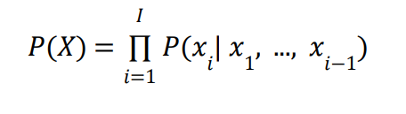
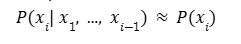
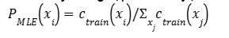
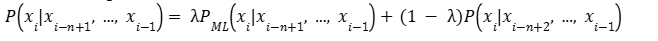
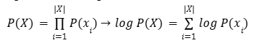
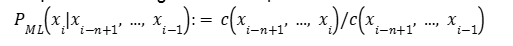
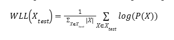
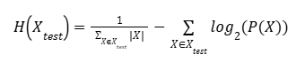
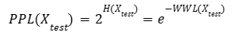
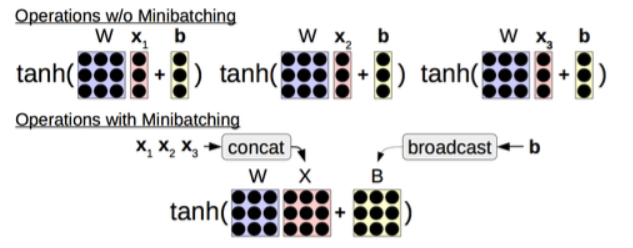

# Advanced NLP from CMU 2024

## Lecture 1. Intro to NLP

## Lecture 2. Word representation and Text Classification

## Lecture 3. Language Modeling

### Contents:
+ Language Modeling Problem Definition

+ Count-based Language Models

+ Measuaring Language Model Performance:
    - Accuracy
    - Likelihood
    - Perplexity

+ Log-linear Language Modes

+ Neural Network Basics

+ Feed-forward Neural Network Language Models

### Nội dung bài học

#### Generative vs Discriminative Models
+ Discriminative Model:
    - compute laten trait based on data
    - formular: *P(Y|X)*
        - Y: một đặc điểm cần xác định. Vd: tích cực/tiêu cực
        - X: đoạn text đầu vào. Vd: 1 đoạn text đầu vào.
    => dự đoán Y cho bởi X
+ Generative Model:
    - compute xác suất độc lập *P(X)* or *P(X, Y)*
    => tập trung mô phỏng & hiểu dữ liệu X

#### Probabilistic Language Model
    - Mô hình tính xác suất ngôn ngữ với 2 kĩ thuật cơ bản: (chưa hiểu)
        - tính xác xuất cho câu. vd: Lá cây màu xanh.
        - tạo câu dựa trên xác xuất
            - lấy mẫu 1 câu từ phân phối xác xuất của LM **Chưa hiểuAuto-RegressiveLanguageModels
            - tim câu có xác xuất cao nhất theo LM

    -  Ứng dụng: 
        - đánh giá (scoring)
            - lủa chọn câu trả lời có xác xuất cao nhất            
            - phân loại văn bản
            - sửa lỗi ngữ pháp

        - tạo sinh (generating)
            - tạo ra phần tiếp theo cho 1 câu hỏi

+ Auto-Regressive Language Models
    - tính toán xác suất có điều kiện 1 token dựa trên token trước đó.

        
    
    - Mô hình ngôn ngữ bị che khuất (masked language models) nhuw BERT
        - dự đoán 1 từ dựa trên các từ còn lại trong chuỗi
        - Limitation:
            - không xác định thứ tự sinh ra => khó khăn sinh văn bản
            - không cung cấp chính xác cho chuỗi ngôn ngữ
        
    - Mô hình ngôn ngữ dựa trên năng lượng (energy-based)
            - tạo ra một hàm diểm số không theo thứ tự cụ thể nào

#### Unigram Language Models
+ tính xác suất từ tiếp theo dựa mà không quan tâm từ trước đó.
    - Công thức:
        

    - đếm số lần xuất hiện của từ chia cho tổng số từ trong tập dữ liệu:
        

    - Limitations:
        - khi gặp 1 chuỗi chưa từng xuất hiện -> xác suất bằng 0
        - *solution*: 
            - sử dụng các mô hình (n-1) gram ngắn hơn.
            - cho phép xử lý các mô hình có độ chính xác cao nhưng hiếm gặp & các mô hình ít chính xác nhưng phổ biến

        
    
+ Problems:
    - Handling unknow words (-> xác suất bằng 0)
        - dịch ngôn ngữ
        - solutions:
            - phân chia từ chưa biết thành các từ con
            - xây dựng 1 mô hình từ chưa biết.
                - Step 1: dự đoán xác suất của từ chưa biết dựa trên các kí tự
                - Step 2: mô hình hóa xác suất các từ bằng cách sử dụng chính các từ.

    - Parameterzing in Log Space
        - xác suất quá nhỏ ~ 0 => log 
        

#### Higher-order Language Models

+ Higher-order n-grams models
    - mô hình ngôn ngữ bậc cao hoạt động bằng cách giới hạn độ dài ngữ cảnh N.
        

+ Smoothing methods 

+ Problems & solutions
    - problem 01: không chia sẻ các từ tương đồng.
        - solution: class-based language model:
            - nhóm các từ tương đồng thành 1 class
    - problem 02: không thể điều kiện hóa ngữ cảnh với các từ xen kẽ -> nễu xuất hiện 1 từ hiếm gặp thì mô hình quan về phân phối unigram & trở nên kém hiệu quả.
        - solution: **skip-gram mode** - được thiết kế để học các embedding từ bằng cách dự đoán các từ trong ngữ cảnh xung quanh từ một từ mục tiêu.
    - problem 03: không thể xử lý các từ xa
        - chỉ cần nhắc sử dụng gần nhất để dự đoán
        - solution: LSTM, transformers.

+ Khi nào sử dụng N-gram Models ?
    - mô hình hóa các hiện tượng (từ/cụm từ) có tần suất thấp do n-gram dựa vào các chuỗi từ ngắn (n- từ liên tiếp) & có thể ghi nhớ các mẫu ngữ nghĩa đơn giản không cần lượng lớn dữ liệu để học.
    - công cụ ước lượng n-gram: https://github.com/kpu/kenlm

#### LM Evaluation

+ Likelihood
    - lihood: xác suất thông thường.
        - khi làm việc với dữ liệu lớn => lihood dẫn đến tích của nhiều xác suất => giá trị nhỏ (về 0)

    - LL có hạn chế khi số lượng dữ liệu lớn => giá trị sẽ lớn.
        - khắc phục: per-word log Likelihood ~ chia toàn bộ xác suất của bộ tập hợp cho tổng số từ trong tập hợp. Thường biết đến **Negative Log-likelihood**.

        

+ Cross Entropy
    - Entropy: đo lường sự hỗ loạn (sự không chắc chắn của thông tin/sự kiện), ngẫu nhiên của 1 hệ thống thông tin.
        - nếu entropy "trung bình" ~ 50% => việc dự đoán khó và ngược lại.
        - nếu entropy tập trung ở biên (rất cao/rất thấp) => dễ đoán.
    - Cross-entropy: đo lường sự khác biệt giữa 2 phân bố xác suất:
        - phân phối thực tế (thường được gán nhãn) vs phân phối dự đoán.
    - Per-word Cross Entropy:

       

+ An Aside: LMs and Compression
    - *nguyên tắc cơ bản của lý thuyết thông tin*: thông tin bất ngờ/khó xảy ra cần nhiều bit để mã hóa hơn các tin phổ biến/dễ đoán => nguyên tắc nén sử dụng mã hóa số học **arithmetic coding**
        - Bắt đầu với một khoảng từ 0 đến 1
        - Khi xử lý từng ký tự trong chuỗi đầu vào, khoảng này được chia nhỏ dựa trên xác suất của ký tự đó.
        - Khoảng con tương ứng ký tự hiện tại trở thành khoảng mới cho cho ký tự tiếp theo.
        - Quá trình này tiếp tục cho đến khi xử lý hết chuỗi đầu vào.
        - Cuối cùng một số duy nhất trong khoảng cuối cùng được chọn để làm đại diện cho toàn bộ chuỗi.

+ Perplexity
    - thước đo khả năng dự đoán của một mô hình xác suất
    
    

+ Evaluation and Vocabulary
    ! đảm bảo mẫu số giống nhau. Nếu sử dụng perplexity => đảm bảo tập mẫu giống nhau mỗi lần.

#### An Alternative: Featured Log-Linear Models
+ một nhược điểm của cac mode NN or Bag-of-words đó là khoảng cách giữa các từ.

#### Back to Language Modeling

#### Other desiderata of LMs

+ Calibration (hiệu chuẩn)
    - mô hình biết khi nào nó có câu trả lời đúng ~ khả năng cung cấp độ tin cậy chính xác cho câu trả lời. Vd: nếu xác suất trả lời đúng là 0.7 => trả lời đúng 70 lần / 100 lần hỏi (sử dụng reliabillity diagram)

    - độ hiệu chỉnh (độ tự tin) & độ chính xác (tỉ lệ sai sót) không nhất thiết phải đi đôi.

+ How to calculate answer probability ? 
    - khó khăn khi có nhiều câu trả lời đúng -> có thể lấy tổng xác suất.
    - lấy nhiều mẫu đầu vào & đếm số lần nhận được câu trả lời cụ thể.
        - limitation: cách diễn đạt khác nhau.
        - Pros: không thể lấy xác suất từ một số mô hình.

+ Efficiency thông qua metrics:
    - số lượng tham số 
    - sử dụng bộ nhớ
        - bộ nhớ chỉ có mô hình
        - đỉnh tiêu thu bộ nhớ 
    - độ trễ    
        - thời gian để bắt đầu xuất ra 1 token đầu tiên
        - thơi gian để hoàn thành việc xuất ra 1 chuỗi có độ dài nhất định.
            - thời gian mã hóa 
            - thời gian sinh chuỗi
    - thông lượng

#### Efficiency trick

+ Efficiency tricks: Mini-batching
    - ý tưởng: việc thực hiện nhiều phép toàn giống nhau cùng lúc nhanh hơn nhiều so với thực hiện từng phép toán 1.

    

+ GPUs and CPUs

+ A simple example:

+ Speed tricks

## Lecture 4. Sequence Modeling

## Lecture 5. Transformers

## Lecture 6. Generation Algorithms

## Lecture 7. Prompting

## Lecture 8. Fine tuning and Instruction tuning

## Lecture 9. 

## Lecture 10. Retrieval and RAG

## Lecture 11. Quantization, Pruning and Distillation

## Lecture 12. Reinforcement learning from Human Feedback

## Lecture 13. Debugging and Interpretation

## Lecture 14. Ensembling and Mixture of Experts

## Lecture 15. Tour of Modern LLMs

## Lecture 16. 

## Lecture 17. Code generation

## Lecture 18. Knowledge and Language Models

## Lecture 19. 

## Lecture 20. Language Agents

## Lecture 21. Complex Reasoning

## Lecture 22. 

## Lecture 23. Multilingual NLP
