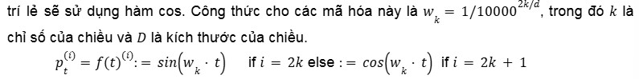

# Advanced NLP from CMU 2024

## Lecture 1. Intro to NLP

## Lecture 2. Word representation and Text Classification

## Lecture 3. Language Modeling

### Contents:
+ Language Modeling Problem Definition

+ Count-based Language Models

+ Measuaring Language Model Performance:
    - Accuracy
    - Likelihood
    - Perplexity

+ Log-linear Language Modes

+ Neural Network Basics

+ Feed-forward Neural Network Language Models

### Nội dung bài học

#### Generative vs Discriminative Models
+ Discriminative Model:
    - compute laten trait based on data
    - formular: *P(Y|X)*
        - Y: một đặc điểm cần xác định. Vd: tích cực/tiêu cực
        - X: đoạn text đầu vào. Vd: 1 đoạn text đầu vào.
    => dự đoán Y cho bởi X
+ Generative Model:
    - compute xác suất độc lập *P(X)* or *P(X, Y)*
    => tập trung mô phỏng & hiểu dữ liệu X

#### Probabilistic Language Model
    - Mô hình tính xác suất ngôn ngữ với 2 kĩ thuật cơ bản: (chưa hiểu)
        - tính xác xuất cho câu. vd: Lá cây màu xanh.
        - tạo câu dựa trên xác xuất
            - lấy mẫu 1 câu từ phân phối xác xuất của LM **Chưa hiểuAuto-RegressiveLanguageModels
            - tim câu có xác xuất cao nhất theo LM

    -  Ứng dụng: 
        - đánh giá (scoring)
            - lủa chọn câu trả lời có xác xuất cao nhất            
            - phân loại văn bản
            - sửa lỗi ngữ pháp

        - tạo sinh (generating)
            - tạo ra phần tiếp theo cho 1 câu hỏi

+ Auto-Regressive Language Models
    - tính toán xác suất có điều kiện 1 token dựa trên token trước đó.

        
    
    - Mô hình ngôn ngữ bị che khuất (masked language models) nhuw BERT
        - dự đoán 1 từ dựa trên các từ còn lại trong chuỗi
        - Limitation:
            - không xác định thứ tự sinh ra => khó khăn sinh văn bản
            - không cung cấp chính xác cho chuỗi ngôn ngữ
        
    - Mô hình ngôn ngữ dựa trên năng lượng (energy-based)
            - tạo ra một hàm diểm số không theo thứ tự cụ thể nào

#### Unigram Language Models
+ tính xác suất từ tiếp theo dựa mà không quan tâm từ trước đó.
    - Công thức:
        

    - đếm số lần xuất hiện của từ chia cho tổng số từ trong tập dữ liệu:
        

    - Limitations:
        - khi gặp 1 chuỗi chưa từng xuất hiện -> xác suất bằng 0
        - *solution*: 
            - sử dụng các mô hình (n-1) gram ngắn hơn.
            - cho phép xử lý các mô hình có độ chính xác cao nhưng hiếm gặp & các mô hình ít chính xác nhưng phổ biến

        
    
+ Problems:
    - Handling unknow words (-> xác suất bằng 0)
        - dịch ngôn ngữ
        - solutions:
            - phân chia từ chưa biết thành các từ con
            - xây dựng 1 mô hình từ chưa biết.
                - Step 1: dự đoán xác suất của từ chưa biết dựa trên các kí tự
                - Step 2: mô hình hóa xác suất các từ bằng cách sử dụng chính các từ.

    - Parameterzing in Log Space
        - xác suất quá nhỏ ~ 0 => log 
        

#### Higher-order Language Models

+ Higher-order n-grams models
    - mô hình ngôn ngữ bậc cao hoạt động bằng cách giới hạn độ dài ngữ cảnh N.
        

+ Smoothing methods 

+ Problems & solutions
    - problem 01: không chia sẻ các từ tương đồng.
        - solution: class-based language model:
            - nhóm các từ tương đồng thành 1 class
    - problem 02: không thể điều kiện hóa ngữ cảnh với các từ xen kẽ -> nễu xuất hiện 1 từ hiếm gặp thì mô hình quan về phân phối unigram & trở nên kém hiệu quả.
        - solution: **skip-gram mode** - được thiết kế để học các embedding từ bằng cách dự đoán các từ trong ngữ cảnh xung quanh từ một từ mục tiêu.
    - problem 03: không thể xử lý các từ xa
        - chỉ cần nhắc sử dụng gần nhất để dự đoán
        - solution: LSTM, transformers.

+ Khi nào sử dụng N-gram Models ?
    - mô hình hóa các hiện tượng (từ/cụm từ) có tần suất thấp do n-gram dựa vào các chuỗi từ ngắn (n- từ liên tiếp) & có thể ghi nhớ các mẫu ngữ nghĩa đơn giản không cần lượng lớn dữ liệu để học.
    - công cụ ước lượng n-gram: https://github.com/kpu/kenlm

#### LM Evaluation

+ Likelihood
    - lihood: xác suất thông thường.
        - khi làm việc với dữ liệu lớn => lihood dẫn đến tích của nhiều xác suất => giá trị nhỏ (về 0)

    - LL có hạn chế khi số lượng dữ liệu lớn => giá trị sẽ lớn.
        - khắc phục: per-word log Likelihood ~ chia toàn bộ xác suất của bộ tập hợp cho tổng số từ trong tập hợp. Thường biết đến **Negative Log-likelihood**.

        

+ Cross Entropy
    - Entropy: đo lường sự hỗ loạn (sự không chắc chắn của thông tin/sự kiện), ngẫu nhiên của 1 hệ thống thông tin.
        - nếu entropy "trung bình" ~ 50% => việc dự đoán khó và ngược lại.
        - nếu entropy tập trung ở biên (rất cao/rất thấp) => dễ đoán.
    - Cross-entropy: đo lường sự khác biệt giữa 2 phân bố xác suất:
        - phân phối thực tế (thường được gán nhãn) vs phân phối dự đoán.
    - Per-word Cross Entropy:

       

+ An Aside: LMs and Compression
    - *nguyên tắc cơ bản của lý thuyết thông tin*: thông tin bất ngờ/khó xảy ra cần nhiều bit để mã hóa hơn các tin phổ biến/dễ đoán => nguyên tắc nén sử dụng mã hóa số học **arithmetic coding**
        - Bắt đầu với một khoảng từ 0 đến 1
        - Khi xử lý từng ký tự trong chuỗi đầu vào, khoảng này được chia nhỏ dựa trên xác suất của ký tự đó.
        - Khoảng con tương ứng ký tự hiện tại trở thành khoảng mới cho cho ký tự tiếp theo.
        - Quá trình này tiếp tục cho đến khi xử lý hết chuỗi đầu vào.
        - Cuối cùng một số duy nhất trong khoảng cuối cùng được chọn để làm đại diện cho toàn bộ chuỗi.

+ Perplexity
    - thước đo khả năng dự đoán của một mô hình xác suất
    
    

+ Evaluation and Vocabulary
    ! đảm bảo mẫu số giống nhau. Nếu sử dụng perplexity => đảm bảo tập mẫu giống nhau mỗi lần.

#### An Alternative: Featured Log-Linear Models
+ một nhược điểm của cac mode NN or Bag-of-words đó là khoảng cách giữa các từ.

#### Back to Language Modeling

#### Other desiderata of LMs

+ Calibration (hiệu chuẩn)
    - mô hình biết khi nào nó có câu trả lời đúng ~ khả năng cung cấp độ tin cậy chính xác cho câu trả lời. Vd: nếu xác suất trả lời đúng là 0.7 => trả lời đúng 70 lần / 100 lần hỏi (sử dụng reliabillity diagram)

    - độ hiệu chỉnh (độ tự tin) & độ chính xác (tỉ lệ sai sót) không nhất thiết phải đi đôi.

+ How to calculate answer probability ? 
    - khó khăn khi có nhiều câu trả lời đúng -> có thể lấy tổng xác suất.
    - lấy nhiều mẫu đầu vào & đếm số lần nhận được câu trả lời cụ thể.
        - limitation: cách diễn đạt khác nhau.
        - Pros: không thể lấy xác suất từ một số mô hình.

+ Efficiency thông qua metrics:
    - số lượng tham số 
    - sử dụng bộ nhớ
        - bộ nhớ chỉ có mô hình
        - đỉnh tiêu thu bộ nhớ 
    - độ trễ    
        - thời gian để bắt đầu xuất ra 1 token đầu tiên
        - thơi gian để hoàn thành việc xuất ra 1 chuỗi có độ dài nhất định.
            - thời gian mã hóa 
            - thời gian sinh chuỗi
    - thông lượng

#### Efficiency trick

+ Efficiency tricks: Mini-batching
    - ý tưởng: việc thực hiện nhiều phép toàn giống nhau cùng lúc nhanh hơn nhiều so với thực hiện từng phép toán 1.

    - **Recommend**: tính kích thước mini-batch dựa trên số lượng token trong mini-batch.

    

+ GPUs and CPUs
    - khác nhau CPUs & GPUs là tốc độ khởi động & hiệu suất tính toán dữ liệu lớn.

+ A simple example:
   

+ Speed tricks
    - hạn chế lặp lại các phép toán. Thay vì tính toán trên vector thì tính toán trên matrix.
    - giảm thiểu việc di chuyển dữ liệu giữa CPU & GPU
        - nếu bắt buộc di chuyển bộ nhớ -> cố gắng thực hiện càng sớm & càng ít lần càng tốt.

## Lecture 4. Sequence Modeling

### NLP and Sequential Data

### Types of Sequential Prediction Problems

### An Aside: More on Sequence Labeling

### Types of Sequence Models

### A Sequence Model: Recurrent Neural Networks

### Vanishing Gradients

### Convolution

### Attention

+ Basic idea
    - *ý tưởng*: tìm cách kết nối mỗi điểm của encoder tới thẳng decoder => encoder-decoder + Attention 
    - cho phép mã hóa từng token trong 1 chuỗi -> vector:
        - thực hiện phép kết hợp tuyến tính của các vector + các trọng số được xác định bởi attention weights.
        
        - ! Kết hợp như thế nào ? hãy mô tả rõ ?

+ Cross attention:
    - mỗi phần tử trong 1 chuỗi sẽ chú đến các phần tử trong chuỗi khác. Với các mô hình encoder-decoder: T5 & BERT 
        
        - ! hãy làm rõ

+ Self attention:
    - cho phép mỗi phần tử trong chuỗi chú ý đến các phần tử khác trong cùng một chuỗi.
        - vd: mã hóa 1 câu tiếng anh trước khi dịch sang tiếng việt.

+ Calculating attention:
    - các giá trị attention không phải là xác suất

+ Attention score functions
    - attention score function:
        - trong các kiến trúc transformers

+ Masking for training 
    - *với autogressive model, không nên tham chiếu đến thông tin tương lai*
        - vi phạm nguyên tắc & tạo ra mô hình không xác suất ??? <~> không hiệu quả khi cần sinh dữ liệu từ trái -> phải.
    - Masking (số âm vô cùng): ngăn chặn việc sử dụng thông tin từ tương lai.
        - mô hình không có điều kiện => tránh xa thông tin trong tương lai
        - mô hình có điều kiện => sử dụng thông tin 2 chiều để tính toán các đại diện, nhưng k được thực hiện ở phía mục tiêu.

### Application of Sequence Models

+ Encoding Sequences

+ Encoding tokens

### Efficient tricks for Sequence Modeling

+ Handling mini-batching 
    - problem: các từ phụ thuộc vào từ trước đó -> với các sequences có kích thước khác nhau 
    - solution:
        - padding & masking nhằm đồng bộ hóa độ dài.

+ Bucketing/sorting
    - khi xử lý nhiều câu có độ dài không đều => lãng phí tài nguyên tính toán
        - độ chênh lệch quá lớn có thể dẫn tới thiếu bộ nhớ GPU ? tại sao ???
    - solutions:
        - sort các câu theo kích thước trước khi tạo mini-batch -> trade-off: giảm tính ngẫu nhiên trong phân phối dữ liệu (ảnh hưởng SGD)

+ Stride architectures

+ truncated BPTT

## Lecture 5. Transformers

### Transformers
+ Two types of Transformers:
    - Encoder-decoder (T5, BART)
        - clearly inputs & outputs (tóm tắt văn bản hoặc dịch ngôn ngữ)
    - Decoder only (GPT, LLaMA)
        - unclearly inputs & outputs (chat bot)
        - đơn giản

+ Common elements:
    - (Input) Embedding
    - Positional encodings
    - Multi-head attention blocks
        - attention task
    - Feed-forward blocks
        - combine features that be calculated

+ Core Transformers Concepts
    - Multi-head attention
    - Positional encodings
    - Masked attention
    - Residual + layer normalization

+ **?** chuẩn hóa phân đoạn subword

### Multi-head Attention

+ Intuition (trực giác) for Multi-heads
    - thông tin từ các thành phần khác nhau có thể hữu ích nhiều cách khác nhau phụ thuộc vào ngữ cảnh.
        - example: "run a business" & "physically run"
    - nói cách khác, pp này cho phép bạn xem xét từ trên nhiều ngữ cảnh khác nhau.

+ Concept
    - tập hợp vector truy vấn (query vector) & vector khóa (key vector) (số lượng không nhất thiết bằng nhau)
        - **?** vector giá trị (value vector)

    

    - Trình tự tính: 
        - Q * K * V 
    

    - Coding:

+ What Happens w/ Multi-heads?

### Positional Encoding ~ mã hóa vị trí
+ Một vài điểm chú ý:
    - được thêm vào kèm embedding
    - nhằm giải quyết vấn đề ngữ cảnh 
    - **?** liệu đã đủ

+ Sinusoidal Encoding **?**
    - ý tưởng mã hóa vị trí dựa theo hàm sin/cos
        - vị trí chẵn hàm sin & lẻ hàm cos **?**

        
    
    - **Mục đích**:

+ Learned Encoding
    - học các mã hóa - tạo ra 1 embedding có thể học được mà chỉ cần thêm vào

    - 

    - Nhược: 
        - việc suy diễn ra các chuỗi dài hơn so với những gì thấy trong quá trình training là không thể.

+ Absolute vs. Relative Encodings
    - so sánh giữa mã hóa vị trí tuyệt đối & tương đối:
        - mã hóa tuyệt đối như 2 pp trên: việc thêm vào vị trí mà không xem xét khoảng cách giữa vector truy vấn & vector khóa ~ không cân nhắc khoảng cách giữa các vector.
            - **?** vector khóa thể hiện khoảng cách.
        - mã hóa tương đối:
            - không cân nhắc vị trí chính xác của embedding
            - quan tâm đến khoảng cách giữa embedding truy vấn & embedding khóa
    - Nhược điểm: tốn chi phí tính toán vì phải thêm vào

+ Rotary Positional Encoding ~ mã hóa vị trí xoay vòng
    - Ý tưởng: 
        - tạo ra 1 vector mã hóa embedding kết hợp vector thực tế & vị trí (? - định nghĩa 2 vectors)
        - tạo ra 1 vector mã hóa khác kết hợp vector tuyệt đối + vị trí
        - tích 2 vector => hàm chỉ phụ thuộc 2 vectors & vị trí tương đối <-> loại bỏ thông tin vector vị trí tuyệt đối.
        
        

        - ? mô hình có khả năng tổng quát tốt hơn khi gặp các đầu ra mới.

    - dùng trong LLaMA & tác động tốt đến tinh chỉnh các mô hình.

### Layer Normalization and Residual Connections

- Trong RNN, các mô hình thường gặp vấn đền suy hao gradients 

+ Layer Normalization
    - ngăn chặn gradient bủng nổ hoặc không ổn định 
        - ? tại sao gradient lại bị như thế ? ngăn chặn ntn ?
    - Layer Normalization - chuẩn hóa đầu vào trong 1 range -> giảm thiểu sự biến thiên trong quy mô
        - tính toán trung bình các vector
        - tính độ lệch chuẩn
        - tính căn bậc 2 của tổng độ lệch chuẩn

        
    
    - ngoài ra, việc thêm độ lệnh chuản + nhân hệ số khuếch đại.
        - lợi ích:
            - các vector nằm trong không gian nhất quán với vị trí + độ phân tán được xác định bởi bias + gain.

    - Batch Normalization chuẩn hóa toàn bộ các phần tử trên 1 batch.Tập dữ liệu chia thành nhiều batches
    - Những trường hợp dùng Layer Normalization ? không phụ thuộc vào việc chia batch

+ RMSNorm ~ Square Normalization
    - Tương tụ như Layer Norm nhưng loại bỏ chuẩn hóa trung bình ~ giữ nguyên các điểm trong không gian nhưng thực hiện chuẩn hóa lại độ khuếch tán giữa chúng.

        

    - RMS không thực sự tốt hơn Layer Norm nhưng nhanh hơn do giảm lược 1 bước tính toán + giản lược bias chỉ giữ gain.

+ Residual Connections
    - *Là kết nối cộng giữa đầu vào và đầu ra* 
        - ? kết nối ntn ?
        - mục tiêu: 
            - thay vì ánh xạ từ đầu vào -> đầu ra
            - áp dụng sự khác biệt từ đầu vào
        - Lợi ích kết nối phần dư:
            - giảm thiếu việc chú ý đến chính nó mà thay vào đó sẽ tập trung vào các thông tin xung quanh -> hiểu rõ hơn về ngữ cảnh.
                - Thông tin từ của mỗi từ được 

        

+ Post- vs. Pre-Layer Norm
    - ban đầu: Layer Norm áp dụng sau multi-head attention & feed-forward network.
        - ảnh hưởng: khó khăn lan truyền gradient khi có 1 hàm khác ngoài hàm đồng nhất (identity) ở giữa các lớp.
        - ! bất kì hàm nào ngoài hàm đồng nhất đều có thể thay đổi gradient.
    - Việc sử dụng pre-layer norm với layer norm áp dụng trước các lớp multi-head attention & feed-forward.
        - tạo ra 1 kết nối phần dư trực tiếp từ đầu đến cuối => cải thiện tryền gradient & giúp quá trình training ổn định hơn.

    

### Feed Forward Layers

+ Feed Forward Layers
    - trích xuất các đặc trưng (từng vector trong chuỗi) kết hợp đầu ra đã được chú ý.
        - ? việc loại bỏ bias do tham số này không thực sự cần thiết.

    

    - hàm f:
        - thường là loại phi tuyến
        - mỗi phần tử trong vector ~ 1 feature. 
        - mạng này mở rộng đến vector lớn hơn để trích xuất nhiều đặc trưng.
+ Some Activation Functions in Transformers
    - ReLU (0, x)
        - *Problem*: khi đầu vào nhỏ hơn 0 -> gradietn = 0
        - *Solution*: SiLU

        

### Optimization Tricsk for Transformers

+ Transformers are Powerful but Fickle

+ Optimizers for Transformers
    - SGD - hướng giảm thiểu hàm mất mát
    - Adam - thêm thành phần động lượng & chuẩn hóa theo độ lẹch chuẩn của các đầu ra -> ? cập nhật các tham số (ít được cập nhật) thường xuyên hơn

+ Low-Precision Training
    - giảm thiểu tốn kém trong training bằng việc giảm: 32 bits -? 16 bits
        - fp 16 
        - bfoat 16

+ Checkpointing/ Restarts
    - lưu lại checkpoints giúp khởi động lại nhanh tiến trình training
        - ?  trong quá trình huấn luyện của Meta, khi theo dõi độ lớn của gradient, có thể thấy rằng nó đột ngột tăng cao, điều này thường chỉ ra một vấn đề. Sau khi tăng đột biến, perplexity của mô hình có thể giảm xuống một thời gian, nhưng sau đó lại bắt đầu tăng lên, cho thấy mô hình đang ở trong một trạng thái không tốt trong không gian tham số

### Comparing Transformers Architectures

+ Original Transformers vs. LlaMa
    - Transformers:
        - post-norm
        - LayerNorm
        - ReLU
    - LlaMa:
        - pre-norm
        - RMSNorm
        - SiLU
+ How Important is It?
    - perplexity metrics

    

## Lecture 6. Generation Algorithms

## Lecture 7. Prompting

## Lecture 8. Fine tuning and Instruction tuning)

## Lecture 9. 

## Lecture 10. Retrieval and RAG

## Lecture 11. Quantization, Pruning and Distillation

## Lecture 12. Reinforcement learning from Human Feedback

## Lecture 13. Debugging and Interpretation

## Lecture 14. Ensembling and Mixture of Experts

## Lecture 15. Tour of Modern LLMs

## Lecture 16. 

## Lecture 17. Code generation

## Lecture 18. Knowledge and Language Models

## Lecture 19. 

## Lecture 20. Language Agents

## Lecture 21. Complex Reasoning

## Lecture 22. 

## Lecture 23. Multilingual NLP
